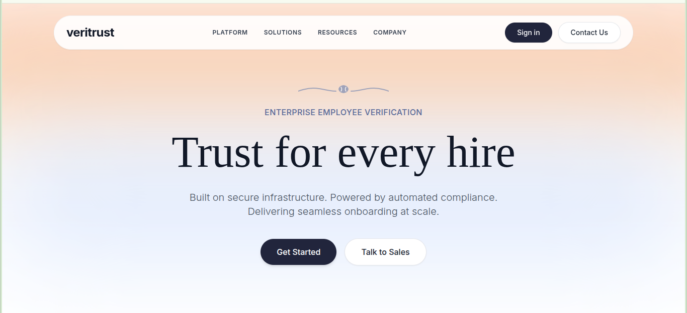

# VeriTrust

VeriTrust is an enterprise-grade HR and administration platform designed for modern organizations to securely manage user access and operational records. Built to handle complex organizational data, it provides robust role-based access control, ensuring that administrators and general users have appropriate system privileges.

## Live Demo

**Frontend:**
[https://veri-trust-rosy.vercel.app/](https://veri-trust-rosy.vercel.app/)

**Backend:**
[https://veritrust-hhcj.onrender.com](https://veritrust-hhcj.onrender.com)

## Repository

[https://github.com/tmlganesh/veritrust](https://github.com/tmlganesh/veritrust)

## Project Overview

VeriTrust satisfies comprehensive enterprise requirements by delivering a fully integrated, API-driven architecture. The application enforces strict Role-Based Authentication, clearly separating Admin capabilities (like system-wide user management) from General User access. It offers seamless User Management and Records Management interfaces, allowing administrators to efficiently oversee organizational data. The frontend features a highly responsive UI that adapts to various devices, while the backend simulates real-world conditions through asynchronous processing to demonstrate proper loading states and reactive data handling.

## Features

| Feature | Description |
| :--- | :--- |
| **Authentication** | Secure login system using JWT for robust session management. |
| **Role-Based Access Control** | Distinct permission levels restricting features for Admin and General User roles. |
| **User Management** | Comprehensive CRUD capabilities for administrators to manage employee accounts. |
| **Records Dashboard** | Centralized interface for viewing and managing organizational records. |
| **Search and Filtering** | Advanced querying tools to quickly locate specific users and records. |
| **Async API Delay Simulation** | Intentional network delays to demonstrate loading states and UI responsiveness. |
| **Activity Logs** | Detailed tracking of system actions for auditing and operational monitoring. |
| **Responsive Design** | Fluid layout that functions flawlessly across desktop, tablet, and mobile devices. |
| **Logout Functionality** | Secure session termination with proper token invalidation. |

## Screenshots

### Landing Page


## Technology Stack

| Category | Technology |
| :--- | :--- |
| **Frontend** | Angular, TypeScript, Tailwind CSS |
| **Backend** | Node.js, Express.js |
| **Database** | MongoDB Atlas, Mongoose |
| **Authentication** | JSON Web Tokens (JWT), bcrypt |
| **Deployment** | Vercel (Frontend), Render (Backend) |

## Architecture

```text
Frontend (Angular)
       ↓
  Node.js API
       ↓
 MongoDB Atlas
```

The data flow begins at the Angular frontend, which captures user interactions and dispatches HTTP requests via integrated services. These requests are routed through the Express-driven Node.js REST API. The backend validates permissions, executes the corresponding asynchronous operations against the MongoDB Atlas cluster, and returns the formatted response back to the responsive client interface.

## Folder Structure

```text
veritrust/
├── frontend/
│   ├── src/
│   │   ├── app/
│   │   │   ├── core/          
│   │   │   ├── features/      
│   │   │   └── shared/        
│   │   └── environments/      
│   └── vercel.json
└── backend/
    ├── src/
    │   ├── controllers/       
    │   ├── models/            
    │   ├── routes/            
    │   └── middlewares/       
    └── server.js
```

## API Highlights

* `POST /auth/login`
* `GET /records`
* `GET /users`
* `POST /users`
* `PUT /users/:id`
* `DELETE /users/:id`

## Async Processing Demonstration

To accurately simulate a real-world enterprise environment, VeriTrust intentionally introduces configurable API delays across its endpoints. This architectural decision explicitly demonstrates the application's capability to handle asynchronous data handling gracefully. By simulating latency, the UI effectively showcases loading states, skeleton loaders, and reactive UI updates, ensuring a polished user experience even under non-ideal network conditions. This implementation directly satisfies the assignment requirement for asynchronous data handling.

## Default Credentials

| Role | Email | Password |
| :--- | :--- | :--- |
| **Admin** | `admin@admin.com` | `admin123` |
| **User** | `user@user.com` | `user123` |

## Getting Started

```bash
npm install
npm run dev
```

## Assignment Requirement Mapping

| Requirement | Implementation |
| :--- | :--- |
| **Role-based Authentication** | JWT-based auth with middleware validating Admin/User permissions. |
| **Admin and General User Access** | Conditional UI rendering and protected routing based on user roles. |
| **User Management** | Complete CRUD interfaces for administrators to oversee system users. |
| **Records Management** | Dedicated dashboard allowing authorized roles to view/manage data. |
| **API-driven Architecture** | Decoupled Node.js REST API communicating seamlessly with the frontend. |
| **Async Processing Simulation** | Configurable artificial delays on API routes with UI loading states. |
| **Responsive UI** | Mobile-first design utilizing flexible layouts and modern CSS. |

## Future Improvements

* Email notifications
* Audit exports
* Advanced analytics
* Multi-factor authentication
* Role customization

## Author

**Name:**  
Ganesh T M L

**GitHub:**  
[https://github.com/tmlganesh](https://github.com/tmlganesh)